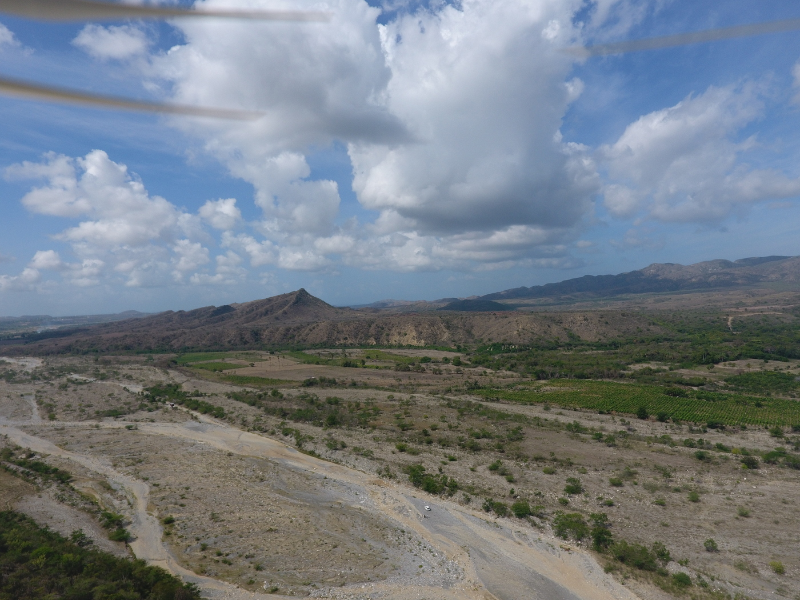
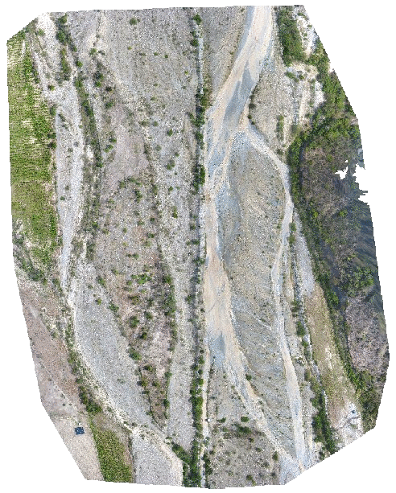
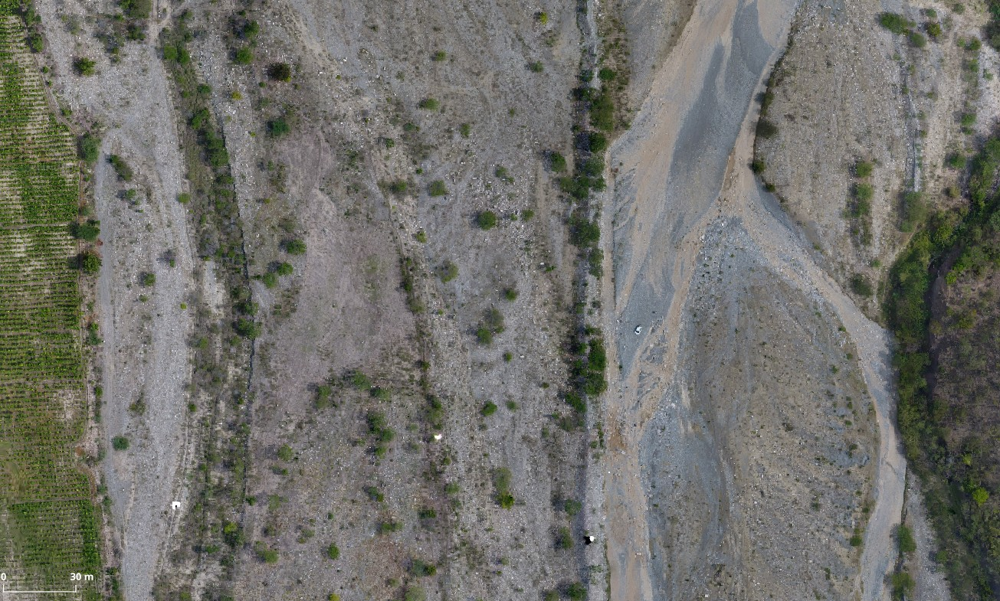
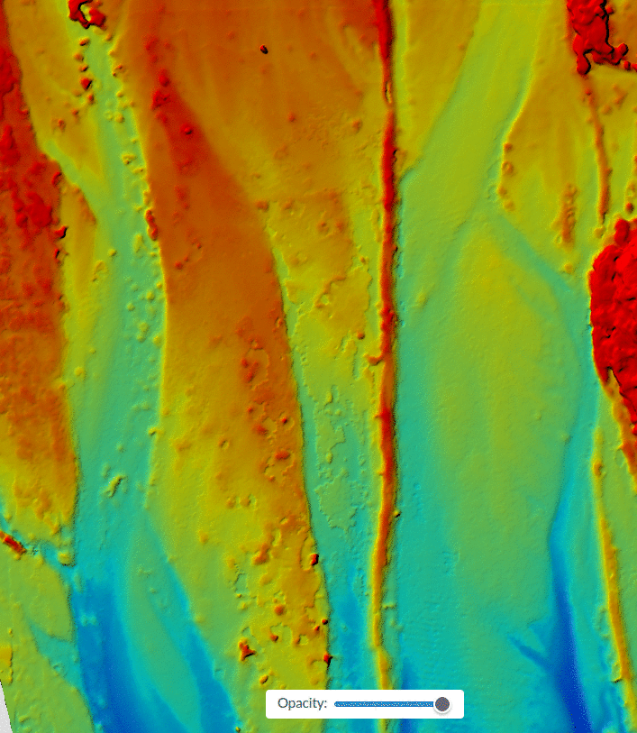
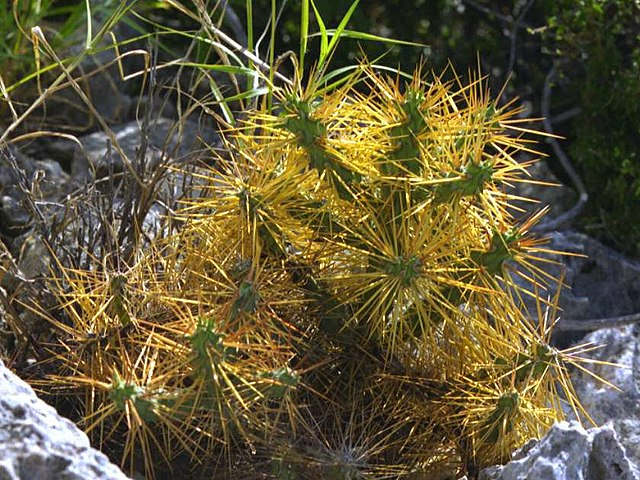
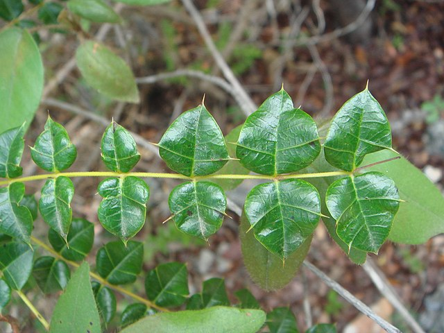
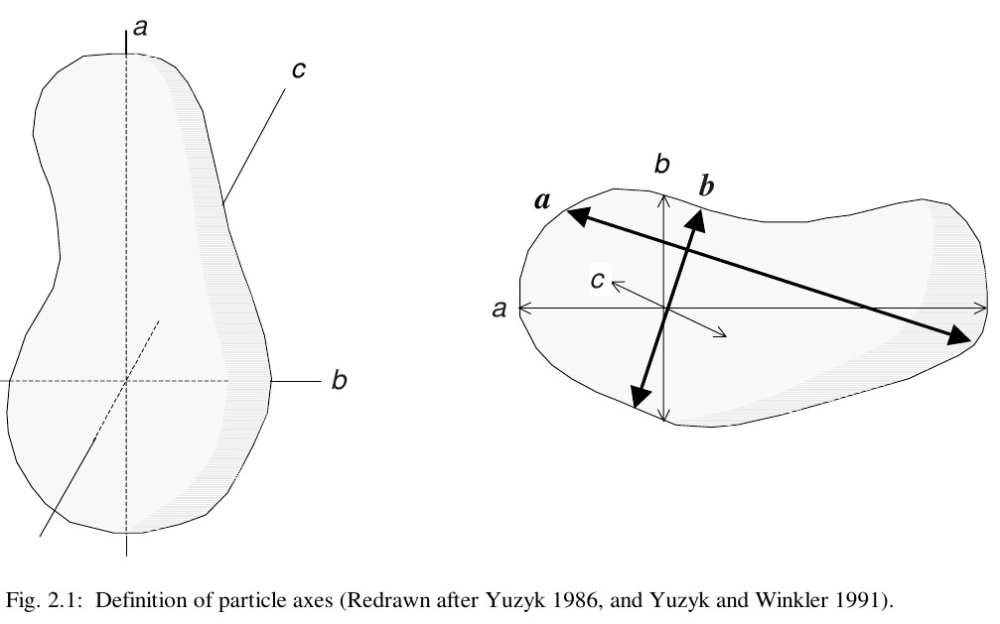

```{r setup, include=FALSE}
knitr::opts_chunk$set(
  # cache = TRUE,
  echo = TRUE,
  message=FALSE,
  warning=FALSE)
```

```{r}
# Paquetes
library(sf)
library(tidyverse)
library(kableExtra)
library(h3jsr)
library(mapview)
library(leaflet)
library(units)
library(stringi)
library(qrcode)
source('R/funciones.R')
```

```{r, eval=F}
# Índice espacial en área de interés extendida (abarca ortofoto y área externa)
aoi <- st_read('fuentes/aoi-extendida.gpkg')
plot(aoi)
resolucion <- 10
ind_esp <- polygon_to_cells(aoi, res = resolucion, simple = FALSE)
ind_esp <- cell_to_polygon(unlist(ind_esp$h3_addresses), simple = FALSE)
plot(aoi_extra)
plot(aoi)
plot(ind_esp %>% st_geometry(), add = T)
# st_write(ind_esp, 'fuentes/h3-resolucion-10.gpkg', delete_dsn = T)
```

```{r}
# Renombrar índice usando direcciones cardinales
# Cargar índice desde archivo.
# Si se necesita un nuevo índice, entonces modificar el bloque de código anterior
ind_esp <- st_read('fuentes/h3-resolucion-10.gpkg', quiet = T)
ind_esp_xy <- st_coordinates(st_centroid(ind_esp))
ind_esp_ord <- ind_esp[order(ind_esp_xy[,"Y"], ind_esp_xy[,"X"], decreasing = T),]
ind_esp_ord$id_num <- 1:nrow(ind_esp_ord)
ind_esp_ord <- ind_esp_ord %>%
  mutate(id_alfanum = paste0('h',
                             stri_pad_left(as.character(id_num),
                                           max(nchar(id_num)), 0)))
ind_esp_ord_sin_radios_mapa <- ind_esp_ord %>% ggplot + aes(label = id_alfanum) +
  geom_sf() + theme_bw() + geom_sf_text(size = 2) +
  scale_x_continuous(breaks = round(range(st_coordinates(ind_esp_ord)[,'X']), 3))
# st_write(ind_esp_ord, 'fuentes/ordenados.gpkg', delete_dsn = T)
# st_write(ind_esp_ord %>% st_cast('LINESTRING'), 'fuentes/ordenados-lineas.gpkg', delete_dsn = T)
# st_write(ind_esp_ord %>% st_centroid, 'fuentes/centroides.gpkg', delete_dsn = T)

# Generar radios
radios <- generar_radios(ind_esp_ord, 'id_alfanum')
ind_esp_ord_con_radios_mapa <- ind_esp_ord %>% ggplot + aes(label = id_alfanum, colour = id_alfanum) +
  geom_sf() +
  geom_sf(data = radios, aes(colour = id_alfanum)) +
  geom_sf_text(size = 3, colour = 'black') +
  theme_bw() + 
  theme(legend.position = 'none') +
  scale_x_continuous(breaks = round(range(st_coordinates(ind_esp_ord)[,'X']), 3))
# st_write(radios, 'fuentes/radios.gpkg', delete_dsn = T)

###########################
# Clasificar hexágonos en función de si están en ortofoto o fuera de ella

###########################
# GEOMORFOLOGÍA: Asignación por estudiante
asignacion_geomorfologia <- ind_esp_ord %>% filter(id_num>=18 & id_num<=41)
estudiantes_geom <- c("Lewis Jose Cueto Montero", "Saderis Carmona Marte",
                      "Jennifer Maladonado", "Jennifer Nuñez Montero")
asignacion_geomorfologia$asignacion <- rep(estudiantes_geom, each=6)


###########################
# BIOGEOGRAFÍA: Asignación por estudiante
asignacion_biogeografia <- ind_esp_ord %>% filter(id_num>=12 & id_num<=46)
estudiantes_biogeo <- c("Camila Méndez Isabel", "Lewis Jose Cueto Montero",
                        "Franklin Cosme", "Lourguis Acosta", "Emely Herrera Arias",
                        "Jeimy Filpo Sisa", "Carlos Alcantara")
asignacion_biogeografia$asignacion <- rep(estudiantes_biogeo, each=5)
```

Accede a la versión en línea de este archivo mediante el siguiente código QR.

```{r, fig.width=2, fig.height=2, echo=F}
plot(qr_code('https://geofis.github.io/diseno-muestreo-los-pilones/README.html'))
```

# Logística básica de la salida de campo

El 12 de abril de 2023, tres estudiantes de la licenciatura en Geografía (Carlos Alcántara, Cinthia Vandepool e Isaac de la Rosa), y yo mesmamente, realizamos un vuelo fotogramétrico con drone y colectamos información topográfica por medio de receptor GNSS-RTK, como parte de un levantamiento de información previa para esta salida de campo en el cauce del río Ocoa, al sur de las localidades Los Pilones, Las Carreras y Boquerón.

Adquirimos unas 250 fotografías aéreas verticales (no faltaron los típicos vídeos y fotos de grupo). Toda la información colectada se procesará para extraer patrones de vegetación y morfológicos, por medio de procesamiento fotogramétrico con OpenDroneMap y posproceso de datos GNSS con RTKLIB. Más detalles en información suplementaria. Incluyo a continuación algunas ilustraciones para que te formes una idea previa sobre el área que visitaremos.

{width="50%"}

La vista oblicua anterior está orientada hacia el sudoeste, mostrando principalmente el cauce del río Ocoa, justo al sur de Los Pilones, Boquerón y Las Carreras. En primer plano, izquierda, subconjunto oriental de canales trenzados (sistema "braided") no inundados (vehículo blanco como escala, visible sobre el sistema de canales). Justo al oeste del sistema de canales (centro, cubriendo a lo ancho en la foto), se observa una isla bien estabilizada por la vegetación, delimitada por un dique visiblemente realizado por maquinaria en su borde oriental, y sobre la cual crece matorral seco perturbado, tanto disperso como denso. Hacia el oeste y sur de la isla (centro y centro-izquierda en la foto), destacan cultivos de musáceas. En segundo plano, izquierda, se observa la loma de Moreta, al pie de la cual se enclava un posible valle fluvial colgado. El cauce se incide entre las rocas de la Formación Ocoa (alternancias de margas, areniscas y calcarenitas).

Aquí tienes un acercamiento gradual animado (la última escena es de Google).



Aquí un detalle estático, donde verás distintos canales, barras y algo de matorral.

{width="50%"}

Y esta otra captura es una animación alternante de la ortofoto ("la imagen realista") y el modelo digital de superficie ("el colorido", o DSM), ambos generados con OpenDroneMap. En la ortofoto, se observa el cauce del río Ocoa, canales trenzados (el punto blanco al centro es un carro); en el DSM, rojo es elevado, azul es deprimido.

{width="50%"}

## Fecha, hora, lugar

-   Fecha: domingo 16 de abril.

-   Hora: debes llegar, como muy tarde, a las 5.45 am.

-   Lugar de salida: Aula Magna, Campus Central.

-   Lugar de destino: Los Pilones (río Ocoa), Boquerón, Ocoa. Este es el destino principal, donde colectaremos nuestros datos. Al terminar, haremos un recorrido en autobús hacia Ocoa, con paradas en la carretera (más detalles sobre paradas, abajo)

-   Podrás disponer de avituallamiento de emergencia (si no pudiste llevar comida) en el Parador Cruce de Ocoa (a la ida).

## ¿Qué llevar?

### Generales

-   **¡Mucha (pero mucha) agua potable!**

-   **Protección contra el sol (protector solar en crema, camisa manga larga, sombrero, ¡TODO es útil!). ¡HARÁ MUCHO SOL!**

-   **Comida** (llevarla puesta, es decir, lista para abrir y comer en cualquier lugar y momento).

-   Repelente. No suele haber mosquitos, pero no está de más llevarlo por si acaso.

-   Por supuesto no hay "código de vestimenta", sólo considera lo siguiente. Usa pantalón largo de tela fuerte y fresca para evitar "puyones". El pantalón corto se desaconseja, pues te expondrá a espinas y picaduras de insectos.

-   **Celular**

    -   Android. Descargar la aplicación [ODK Collect](https://play.google.com/store/apps/details?id=org.odk.collect.android) desde el Play Store.

    -   iPhone. Descargar GIC Collect. No he probado esta aplicación, por lo que es importante que realices tus propias pruebas (ver punto siguiente)

    -   Configurar y probar. Configurar la aplicación ODK Collect o GIC Collect con los detalles que habrás recibido vía correo electrónico. Descarga el formulario que te corresponda (Biogeografía o Geomorfología) presionando "Obtener formulario en blanco". A continuación, haz una prueba intentando llenar (sin enviar) un formulario nuevo, para lo cual dirígite a "Llenar Nuevo Formulario", presionar sobre el nombre del formulario y comenzar a rellenar. Esta prueba te servirá para conocer, a priori, el contenido que rellenarás en terreno. Más detalles, en el tutorial correspondiente de [Biogeografía](https://www.youtube.com/watch?v=KMKJ8tsO1PY) y de Geomorfología

-   Calzado apropiado. El río Ocoa, a su paso por Los Pilones / Los Boquerones, normalmente no lleva mucha agua, pero ya comenzó la temporada húmeda, por lo que, probablemente, tenga algo de caudal. Tus sitios de muestreo "caerán donde caigan", y la probabilidad de que tengas que atravesar el río es bastante elevada. Lleva el calzado con el que te sientas cómodo/a, pero que a la vez te sirva para vadear el río.

-   ¿Te dije ya que llevaras mucha agua y forma de protegerte del sol? Pues por si lo olvidé, lleva mucha agua y protégete del sol.

### Específico para **Geomorfología**

-   Cinta métrica de 3 o de 5 metros máximo (la que tengas), con marcas de centímetros y milímetros.

-   Calibrador pie de rey (caliper), pero puedes prescindir de él si llevas cinta métrica.

-   Ácido muriático (preferiblemente, en pequeño frasco con gotero). Si es de vidrio, cubre el frasco con algo acolchado (e.g. una media) para evitar su rotura.

### Específico para **Biogeografía**

-   Seis frascos de compota + 2 pares de medias (usarás las medias en el campo para proteger los frascos de posibles roturas).

-   Si no puedes adquirir envases de compota, pueden ser de otro tipo, pero asegúrate de que cumplan las siguientes características: de boca ancha, de vidrio, de cierre hermético.

-   Un lápiz de carbón.

-   Llevaré alguna solución de conservación, que puede ser cualquiera de las siguientes, pero si tienes alguna, llévala.

    -   Alcohol etílico (está caro y escaso).

    -   Alcohol isopropílico, que destruye (con el tiempo) las muestras, pero las conserva bien si sólo pasan unos pocos días.

    -   "Romo" (blanco). Tiene baja concentración para conservar animales, pero es mejor que nada (mucho mejor que el agua).

### Recomendados

-   Funda impermeable para celular.

-   Chaleco reflector.

# Seguridad, riesgos, situaciones de emergencia

Los riesgos asociados al viaje de campo son los mismos que en cualquier otro. Considera las siguientes medidas de seguridad:

-   Notifica al menos un contacto de emergencia a tus compañeros y compañeras.

-   Si sufres de alguna condición de salud que consideres importante notificar, indicáselo al profesor.

-   Si vas a entrar o traspasar propiedad privada, pide permiso a las personas en el lugar. Esto aplica especialmente en los hexágonos **h02**, **h25** y **h43**. Si no encuentras personas en el lugar para gestionar el permiso, entonces no entres ni atravieses la propiedad en cuestión. En los demás hexágonos, aunque podrías encontrar cercas y alambres de púa, no se trata de propiedad privada estrictamente (e.g. hexágonos **h22**, **h26**, y otros), pues se trata de área dentro del cauce del río que forman parte del dominio público.

El entorno donde trabajaremos es el cauce de un río, con matorral y bosque seco, por lo que debes considerar las siguientes medidas adicionales:

-   Aunque el lugar es seco, y el río está normalmente dentro de canales muy bien delimitados y conocidos, si comienza fluir agua por canales que, a nuestra llegada, se encontraban secos, deberás dirigirte de inmediato al punto de encuentro o, en su defecto, al lugar donde nos haya dejado el autobús. Notifica a tus compañeros y compañeras sobre tu situación.

-   No todas las especies de plantas tienen espinas, pero casi todas. De manera general, toma precauciones adicionales al pasar la mano cerca del suelo o al caminar entre el matorral; es por esto que no se recomienda pantalón corto. No agarres de tallos o troncos sin antes inspeccionarlos. Y tampoco satanices a estas dos amigas que te presento a continuación, pero respétalas:

|                                                                                                                                                                                        Guasábara                                                                                                                                                                                         |                                                                                                                                                                            Guao                                                                                                                                                                            |
|:----------------------------------:|:----------------------------------:|
|                                                                                                                                                                                                                                                                                                                                                      |                                                                                                                                                                                                                                                                                                                          |
| *Cylindropuntia caribaea* (Britton & Rose) F.M.Knuth. Probabilidad de encontrarla: muy alta. <a href="https://commons.wikimedia.org/wiki/User:CactiLegacy">CactiLegacy</a>, <a href="https://commons.wikimedia.org/wiki/File:Cylindropuntia_caribaea.jpg">Cylindropuntia caribaea</a>, <a href="https://creativecommons.org/licenses/by-sa/4.0/legalcode" rel="license">CC BY-SA 4.0</a> | *Comocladia dodonaea* Britton. Probabilidad de encontrarla: media. <a href="https://commons.wikimedia.org/wiki/User:Xemenendura">Xemenendura</a>, <a href="https://commons.wikimedia.org/wiki/File:Comocladia_dodonaea_1.JPG">Comocladia dodonaea 1</a>, <a href="https://creativecommons.org/licenses/by-sa/3.0/legalcode" rel="license">CC BY-SA 3.0</a> |

# Diseño de muestreo, procedimientos, asignaciones

## Mapa del diseño de muestreo

Despliega el mapa del diseño de muestreo en tu aplicación de GoogleMaps del teléfono usando [este link](https://www.google.com/maps/d/viewer?mid=1mT0xjNIGA2SoPgWzb-qhwi6nZQs-T9k). También puedes usar este código QR:

```{r, fig.width=2, fig.height=2, echo=F}
plot(qr_code('https://www.google.com/maps/d/viewer?mid=1mT0xjNIGA2SoPgWzb-qhwi6nZQs-T9k'))
```

> IMPORTANTE: tan pronto dispongas de internet, descarga el mapa de GoogleMaps en tu celular y conserva una copia para uso sin conexión. En el área hay conectividad, pero es preferible contar adicionalmente con una versión alojada en el teléfono.

A continuación, te muestro un mapa interactivo ligero, pero el completo, y que usarás en terreno, es el que alojé en [GoogleMaps](https://www.google.com/maps/d/viewer?mid=1mT0xjNIGA2SoPgWzb-qhwi6nZQs-T9k).

```{r}
leaflet(ind_esp_ord) %>%
  addPolygons(weight = 3, color = 'red', label = ~id_alfanum,
              fill = 'red', fillOpacity = 0.1) %>%
  addTiles(group = 'OSM') %>%
  addProviderTiles("Esri.NatGeoWorldMap", group="ESRI Mapa") %>%
  addProviderTiles("Esri.WorldImagery", group="ESRI Imagen") %>%
  addProviderTiles("CartoDB.Positron", group= "CartoDB") %>%
  addLayersControl(
    baseGroups = c("ESRI Imagen", "OSM", "ESRI Mapa", "CartoDB"),
    position = 'bottomright',
    options = layersControlOptions(collapsed = FALSE))
```

## Muestreo de hormigas (Biogeografía)

### Objetivo

Aprender una forma de colectar seres vivos usando un diseño de muestreo preestablecido.

### Objetivos específicos

1.  Colectar hormigas que habitan en el suelo, árboles, arbustos y herbáceas, mediante búsqueda "semilibre"

2.  Explorar posibles patrones de distribución de hormigas entre áreas sin vegetación, matorral y bosque perturbado, dentro de un tramo del cauce del río Ocoa en su zona de sedimentación.

### Procedimiento básico para muestreo de hormigas {#procedimientohormigas}

Si no lo has hecho aún, abre tu celular, actívale el GPS, y otórgale permisos de ubicación, de acceso de archivos (para fotos), y otros, a ODK Collect o GIC Collect.

> IMPORTANTE. Esta salida de campo tiene por objetivo principal aprender formas de colectar usando un diseño de muestreo. No se trata de obtener una muestra precisa. Por lo tanto, está permitido equivocarse. Casi con toda seguridad, no podrás seguir el procedimiento descrito abajo al pie de la letra a la primera, pero en la medida en la que lo practiques, ganarás en fluidez y eficiencia.

> Procedimiento resumido. Colectarás hormigas en 12 puntos distintos dentro de cada hexágono. Colocarás 2 puntos de colecta a lo largo de cada uno de los 6 radios del hexágono (lo cual suma 12 puntos). Las colectas dentro de cada punto de un mismo hexágono las combinarás dentro de un único frasco (un frasco por hexágono, lo cual equivale a "1 muestra"). En cada punto de colecta permanecerás por 4 minutos, y deberás separar cada punto a una distancia de 30 pasos caminados en la dirección del radio.

> [Tutorial: Colectar una muestra representativa de hormigas, usando un diseño de muestreo basado en hexágonos H3](https://www.youtube.com/watch?v=KMKJ8tsO1PY)

> [Tutorial: Colectar una muestra representativa de hormigas, usando un diseño de muestreo basado en hexágonos H3, incluye ODK](https://www.youtube.com/watch?v=urzmo0sAkU4)


1.  Usando el <a href="https://www.google.com/maps/d/viewer?mid=1mT0xjNIGA2SoPgWzb-qhwi6nZQs-T9k">mapa de GoogleMaps</a>, sitúate en el centroide del hexágono.

2.  Si el centroide no está marcado aún en el terreno, aprovecha para marcarlo con algo llamativo, como rocas grandes de distinta tonalidad, *flaggings* o escombros, pues será tu referencia mientras tomes la muestra.

3.  Abre ODK Collect o GIC Collect y llena un formulario de "Biogeografía Hormigas". Completa los datos que te pide en la primera página (coordenadas del centroide, foto, etc.). Guarda el formulario presionando el icono del *diskette*, pero déjalo abierto, no lo cierres para que puedas volver a él más tarde. Este formulario será usado a lo largo de todo el hexágono, por eso lo dejarás abierto, y sólo lo cerrarás cuando hayas terminado el hexágono íntegramente (e.g. cuando hayas visitado todos sus radios).

4.  Elige un radio del hexágono (por ejemplo, el número 1, que tendrá un rótulo en el mapa tal que h##r1), intenta determinar el rumbo del mismo usando GoogleMaps.

5.  Camina en la dirección del radio elegido dirigiéndote hacia afuera (apóyate en GoogleMaps) y contando hasta 30 pasos. Hazlo lentamente para que, si te desviaras del rumbo, puedas corregir oportunamente.

6.  Cuando llegues al paso 30, vuelve al formulario que dejaste abierto. Avanza a la página siguiente, te preguntará si quieres **Agregar "Colecta"**, presiona **Agregar** y toma la coordenada. Guarda presionando el icono del *diskette*

7.  Abre el frasco y comienza a contar el tiempo. No tienes que estresarte por durar exactamente 4 minutos (puedes usar un temporizador), pero intenta acercarte lo más que puedas a ese tiempo, para evitar sesgo de muestreo y optimizar el tiempo. Intenta moverte como máximo en 5 metros a la redonda desde el punto en el que iniciaste.

8.  Humedece el pincel en alcohol. Por razones de eficiencia, deberás mantener el frasco abierto mientras colectas (camina despacio), lo cual hará que se evapore algo de alcohol, pero no te preocupes, no se evaporará todo.

9.  Colecta en suelo y, si aplica, en la vegetación (e.g. las que caminen sobre las herbáceas, o sobre árboles y arbustos). Prioriza la seguridad por encima de la colecta; no te "puyes" por querer colectar o perseguir una hormiga. Si no hay vegetación, colecta en contacto con el suelo.

10. Vuelve al punto 5 para realizar una nueva colecta a 30 pasos de ésta en el mismo radio (2 colectas por radio).

11. Cuando termines el radio en cuestión, vuelve al centroide y repite el procedimiento (punto 4 en adelante) hasta completar los 6 radios del hexágono.

12. Cuando alcances la última colecta en el último radio, podrás cerrar el formulario. Para ello, presiona "Siguiente", responde "No agregar" cuando pregunte si deseas agregar nueva colecta.

13. La última pregunta del formulario es sobre observaciones. Si tienes alguna que añadir, este es el momento. De lo contrario, presiona siguiente y guarda tu formulario. Puedes marcarlo como finalizado y enviarlo si lo deseas. También puede desmarcar la casilla de "Finalizado", si tienes previsto revisarlo más adelante; pero no olvides subir tu formulario al servidor tan pronto como puedas. Presiona guardar y el formulario se cerrará. Continúa al hexágono siguiente asignado y repite el procedimiento.

14. Inserta una etiqueta en el frasco. Lo mínimo que deberías incluir es: código del hexágono, tus nombres y apellidos, fecha. Si puedes, añade coordenadas del centroide del hexágono en grados y grados decimales (e.g. 18.23424$^\circ$, -71.82321$^\circ$).

Un cálculo preliminar sugiere que te tomará 1 hora muestrear cada hexágono. El primero probablemente te tomará más tiempo, pero no se trata de correr, se trata de aprender.

### Hexágonos asignados por estudiantes de Biogeografía

```{r}
asignacion_biogeografia %>% st_drop_geometry %>% select(ID = id_alfanum, Nombre = asignacion) %>% 
  kable(format = 'html', escape = F, booktabs = T, digits = 2,
        caption = 'Hexágonos asignados por estudiantes de Biogeografía') %>%
      kable_styling(bootstrap_options = c("hover", "condensed"), full_width = T)
```


## Muestreo de clastos (Geomorfología)

### Objetivo

Aprender una forma de medir clastos usando un diseño de muestreo preestablecido.

### Objetivos específicos

1.  Medir las dimensiones ancho y largo de clastos, usando un diseño de muestreo basado en hexágonos H3.

2.  Explorar posibles patrones de distribución de clastos entre distintas posiciones geomorfológicas del cauce del río Ocoa en su zona de sedimentación.

### Procedimiento básico para muestreo de clastos {#procedimientoclastos}

Si no lo has hecho aún, abre tu celular, actívale el GPS, y otórgale permisos de ubicación, de acceso de archivos (para fotos), y otros, a ODK Collect o GIC Collect.

> IMPORTANTE. Esta salida de campo tiene por objetivo principal aprender formas de colectar usando un diseño de muestreo. No se trata de obtener una muestra precisa. Por lo tanto, está permitido equivocarse. Casi con toda seguridad, no podrás seguir el procedimiento descrito abajo al pie de la letra a la primera, pero en la medida en la que lo practiques, ganarás en fluidez y eficiencia.

> Procedimiento resumido. Medirás los ejes b (ancho) y a (largo) de 36 clastos seleccionados a lo largo de los 6 radios de cada hexágono. Esto significa que, por cada radio, medirás 6 clastos separados por aproximadamente 10 pasos. Una restricción a tener en cuenta: el eje b siempre debe ser menor o igual al eje a.

{width=50%}

> [Tutorial: Realizar mediciones de granulometría, usando un diseño de muestreo basado en hexágonos H3](https://www.youtube.com/watch?v=eWHm_LjJ7gA)

1.  Usando el <a href="https://www.google.com/maps/d/viewer?mid=1mT0xjNIGA2SoPgWzb-qhwi6nZQs-T9k">mapa de GoogleMaps</a>, sitúate en el centroide del hexágono.

2.  Si el centroide no está marcado aún en el terreno, aprovecha para marcarlo con algo llamativo, como rocas grandes de distinta tonalidad, *flaggings* o escombros, pues será tu referencia mientras tomes la muestra.

3.  Abre ODK Collect o GIC Collect y llena un formulario de "Geomorfología Clastos". Completa los datos que te pide en la primera página (coordenadas del centroide, foto, etc.). Guarda el formulario presionando el icono del *diskette*, pero déjalo abierto, no lo cierres para que puedas volver a él más tarde. Este formulario será usado a lo largo de todo el hexágono, por eso lo dejarás abierto, y sólo lo cerrarás cuando hayas terminado el hexágono íntegramente (e.g. cuando hayas visitado todos sus radios).

4.  Elige un radio del hexágono (por ejemplo, el número 1, que tendrá un rótulo en el mapa tal que h##r1), intenta determinar el rumbo del mismo usando GoogleMaps.

5.  Camina en la dirección del radio elegido dirigiéndote hacia afuera (apóyate en GoogleMaps) y contando hasta 30 pasos. Hazlo lentamente para que, si te desviaras del rumbo, puedas corregir oportunamente.

6.  Cuando llegues al paso 10, tomarás nota de la granulometría. Recoge el clasto (si lo hubiere) que quede justo debajo del dedo pulgar, y resérvalo para medirlo en breve. Si el clasto pisado con el pulgar fuese de menos de 10 milímetros, o si no hubiese clasto (e.g. sólo finos, como arena o limos), no recogerás nada, pero deberás tomar nota sobre este particular en el formulario electrónico (ver punto siguiente).

7. Vuelve al formulario que dejaste abierto. Avanza a la página siguiente, te preguntará si quieres **Agregar "Clasto"**, presiona **Agregar**. Este es un subformulario ("formulario hijo") y debes tomar aquí los atributos del clasto o del sedimento. En primer lugar, toma la coordenada. Luego responde si sólo hay arena o no. Si respondes "Sí", guarda el formulario presionando el icono del *diskette* y déjalo abierto para la próxima colecta. Si respsondes "No" (es decir, hay clastos medibles, >10 mm), deberás aportar los tamaños de los ejes ancho (b) y largo (a) en milímetros usando la cinta métrica. **Sé consistente, sólo usa la unidad de medida milímetros**.

8. Vuelve al punto 5 y repite: camina 10 pasos en el mismo radio hasta que tengas 6 subformularios de granulometría dentro del radio. No olvides guardar usando el icono del *diskette*.

9. Cuando termines el radio en cuestión, vuelve al centroide y repite el procedimiento (punto 4 en adelante) hasta completar los 6 radios del hexágono. No olvides guardar usando el icono del *diskette*. 

10. Cuando alcances la última medición en el último radio, podrás cerrar el formulario. Para ello, presiona "Siguiente", responde "No agregar" cuando pregunte si deseas agregar nuevo clasto.

11. La última pregunta del formulario es sobre observaciones. Si tienes alguna que añadir, este es el momento. De lo contrario, presiona siguiente y guarda tu formulario. Puedes marcarlo como finalizado y enviarlo si lo deseas. También puede desmarcar la casilla de "Finalizado", si tienes previsto revisarlo más adelante; pero no olvides subir tu formulario al servidor tan pronto como puedas. Presiona guardar y el formulario se cerrará. Continúa al hexágono siguiente asignado y repite el procedimiento.

Un cálculo preliminar sugiere que te tomará 1 hora muestrear cada hexágono. El primero probablemente te tomará más tiempo, pero no se trata de correr, se trata de aprender.

### Hexágonos asignados por estudiantes de Geomorfología

```{r}
asignacion_geomorfologia %>% st_drop_geometry %>% select(ID = id_alfanum, Nombre = asignacion) %>% 
  kable(format = 'html', escape = F, booktabs = T, digits = 2,
        caption = 'Hexágonos asignados por estudiantes de Geomorfología') %>%
      kable_styling(bootstrap_options = c("hover", "condensed"), full_width = T)
```


# Aplicaciones y servicios útiles para geomorfología y biogeografía

Considera evaluar las siguientes aplicacione. Ssólo las dos primeras son requeridas de forma obligatoria.

-   GoogleMaps (requerida). La necesitarás sí o sí. Te dejo el vínculo del mapa en [GoogleMaps](https://www.google.com/maps/d/viewer?mid=1mT0xjNIGA2SoPgWzb-qhwi6nZQs-T9k)

-   Formularios electrónicos (requerida): [ODK Collect](https://play.google.com/store/apps/details?id=org.odk.collect.android)

-   Mapas en el celular (muchas herramientas disponibles): [OruxMaps](https://www.oruxmaps.com/cs/es)

-   Guardar el trayecto: [GPS Logger](https://play.google.com/store/apps/details?id=eu.basicairdata.graziano.gpslogger)

-   Mapas en el celular: [Mapit GIS](https://play.google.com/store/apps/details?id=com.osedok.gisdatacollector)

-   Mapas en el celular: [SW Maps](https://play.google.com/store/apps/details?id=np.com.softwel.swmaps)

-   Para identificación de especies, reporte, ciencia ciudadana. Créate una cuenta: [iNaturalist](https://www.inaturalist.org/)

-   Ciencia ciudadana, monitoreo y conservaciónde bosque: [Forest Watcher](https://play.google.com/store/apps/details?id=com.forestwatcher)

-   Ciencia ciudadana: [iTree](https://www.itreetools.org/)

-   Predice la flora probable de un lugar. [Pl\@ntNet](https://identify.plantnet.org/)

-   Lista exhaustiva de plantas, nombres: [World Flora Online (WFO) Plant List](https://wfoplantlist.org/plant-list)

# Tutoriales

- [Tutorial: Colectar una muestra representativa de hormigas, usando un diseño de muestreo basado en hexágonos H3](https://www.youtube.com/watch?v=KMKJ8tsO1PY)

- [Tutorial: Colectar una muestra representativa de hormigas, usando un diseño de muestreo basado en hexágonos H3, incluye ODK](https://www.youtube.com/watch?v=urzmo0sAkU4)

- [Tutorial: Realizar mediciones de granulometría, usando un diseño de muestreo basado en hexágonos H3](https://www.youtube.com/watch?v=eWHm_LjJ7gA)

# Paradas

1.  El cauce del río Ocoa, sistema trenzado en contexto de contraste estacional y árido. El matorral/bosque seco perturbado.

2.  Deslizamiento de La Vuelta de La Paloma - Entrada de El Limón. Bosque semideciduo.

3.  Aluvionamiento del Pleisto-Holoceno del río Ocoa. Extracción de materiales en el cauce. La producción agrícola en la cuenca media del río Ocoa.

4.  Bosques conservados de la subcuenca del arroyo Parra.

# Información suplementaria

## ¿Qué información geográfica se levantó de esta área?

## ¿Cómo se adquirió la información fotogramétrica y GNSS?


# Referencias